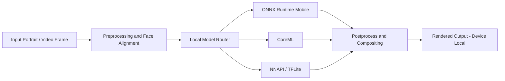

# OfflineMorph

OfflineMorph is a privacy-first mobile AI system for portrait transformation that performs all inference directly on-device, delivering zero-internet execution, sub-second visual feedback, and enterprise-grade user data isolation.

```text
Design Principle: Your face data never leaves your phone.
Execution Model: Local NPU/GPU/CPU acceleration with no cloud fallback.
User Promise: Instant rendering + full biometric privacy sovereignty.
```

## Core Architecture

OfflineMorph is engineered as a multi-runtime, hardware-aware inference stack that prioritizes deterministic local execution and thermal stability under sustained compute loads.

- [x] Inference runtime layer supports ONNX Runtime Mobile for compact cross-platform model execution.
- [x] iOS acceleration path targets Apple CoreML with Metal-backed execution providers.
- [x] Android acceleration path targets NNAPI and TFLite delegates for vendor NPU compatibility.
- [x] Model variants are quantized and calibrated to INT8 and FP16 to optimize memory bandwidth, latency, and battery impact.
- [x] Pipeline orchestration uses operator fusion, tensor reuse, and tiled processing to maintain frame-level responsiveness.



## Feature Roadmap

- [x] Face Swap
	High-fidelity identity transfer with expression-aware blending and skin-tone continuity correction.
- [x] AI Aging / De-aging / Ancestry
	Controlled age progression-regression transformations with morphology-preserving facial priors.
- [x] Studio Hair and Makeup Try-on
	Semantic region targeting for hair geometry, texture transfer, lipstick, contouring, and eye-makeup simulation.
- [x] Virtual Plastic Surgery and Beautifying
	Parametric facial reshaping for non-destructive aesthetic previewing (nose, jawline, cheekbone, symmetry refinement).
- [x] Cinematic 3D Relighting
	Physically plausible portrait relighting with synthetic key-fill-rim generation and shadow-consistent enhancement.
- [x] Micro-Precision Background Matting
	High-resolution alpha extraction for hair edges, transparent accessories, and portrait-grade foreground isolation.

## Targeted Hardware Requirements

OfflineMorph is tuned for flagship-class SoCs and thermal envelopes where sustained AI workloads can remain stable without cloud offload.

| Requirement Dimension | Baseline Target |
| --- | --- |
| Android Reference Device | Samsung Galaxy S25 Ultra (Snapdragon 8 Elite) |
| iOS Reference Device | iPhone 17 Pro Max (A19 Pro) |
| Minimum Memory Envelope | 12 GB RAM for multi-model residency and low paging pressure |
| Compute Acceleration | Native NPU-first scheduling with GPU-assisted image compositing |
| Throughput Goal | Real-time or near-real-time portrait rendering under sustained sessions |
| Thermal Constraint | Operation designed around vapor-chamber cooling boundaries and throttling avoidance |

```text
Performance Intent:
- Keep active model set resident in memory to minimize cold-start penalties.
- Prioritize NPU execution for dense neural operators.
- Defer non-critical enhancements when thermal headroom drops.
```

## Tech Stack Suggestions

- [x] Application Layer: Flutter for rapid cross-platform UI delivery, with selective native modules for latency-critical paths.
- [x] Native Integration: Kotlin/Swift modules for camera, codec, memory, and hardware scheduling controls.
- [x] Inference Runtime: ONNX Runtime Mobile with execution-provider routing per device capability profile.
- [x] Vision Toolkit: MediaPipe for robust landmarking, tracking stabilization, and geometry normalization.
- [x] Rendering Pipeline: Custom GPU shaders (Metal / Vulkan / OpenGL ES) for compositing, relighting, and post effects.

## Privacy Policy Directive

OfflineMorph enforces strict local-only processing: no user photos, videos, embeddings, facial landmarks, or derived biometric artifacts are transmitted to remote servers under any circumstance. The product architecture explicitly prevents external data exfiltration and disallows user-content reuse for remote AI training, analytics profiling, or third-party model enrichment.

```text
Policy Enforcement Summary
- No cloud inference
- No automatic upload of media or metadata
- No server-side identity graph construction
- No remote model-training ingestion from user-generated content
```
